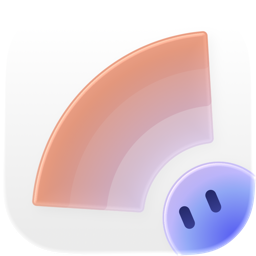
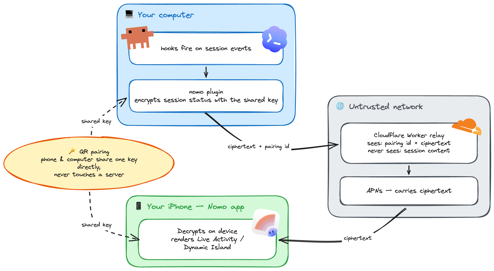

<p align="center"></p>

# Nomo — Live Activity on your iPhone

<p align="center">
&nbsp;&nbsp;
&nbsp;&nbsp;

</p>

Mirror your **Claude Code** and **OpenAI Codex** session milestones to the
**Nomo iPhone app** as a Live Activity (Dynamic Island). A
session's status — working, needs-your-approval, done — shows up on your phone in real time,
so you can step away from the terminal and still know when an agent needs you or has finished.
Works with both **Codex CLI and the Codex desktop app**.

Everything is **end-to-end encrypted**. Pairing is a single QR-code scan (or a short typed code);
there is no server key to copy. All session content (titles, machine name, status, even *which* agent produced an
event) rides **inside** an encrypted blob, so the relay Worker that fans out the APNs push is a
blind relay and never sees plaintext. **One pairing covers both agents** on a machine — Claude
Code and Codex share the same credentials, encryption key, watchdog, and Live Activity.

The PC side ships as two manifests over one shared `plugin/` directory: a **Claude Code plugin**
(`nomo-cc`) and a **native Codex plugin** (`nomo`). Both bundle the same self-contained `.mjs`
hooks, the liveness watchdog, and the interactive commands as single-file artifacts that run under
**either bun or node ≥ 18** (a `run.sh` shim picks whichever is installed). There are **zero npm
dependencies** — Node built-ins only.

## Architecture — end-to-end encrypted

Pairing hands your phone and computer **one shared key**, delivered directly through the QR code —
it never touches any server. The plugin encrypts every session update with that key **before**
anything leaves your machine, so the relay Worker and Apple's push service only ever carry
ciphertext. Decryption happens on your iPhone.

<picture>
  <source media="(prefers-color-scheme: dark)" srcset="assets/architecture-dark.png">
  
</picture>

<sub>Diagram source: [`assets/architecture.excalidraw`](assets/architecture.excalidraw) — open it at [excalidraw.com](https://excalidraw.com) to edit.</sub>

**Plaintext — titles, machine name, status, even which agent produced the event — never leaves
your computer except end-to-end encrypted.** The Worker is a blind fan-out relay: it can route by
pairing id but cannot read a single field of what it forwards.

##  Install — Claude Code

From inside Claude Code:

```
/plugin marketplace add KarrixLee/nomo
/plugin install nomo-cc@nomo
```

Then pair this machine with your phone:

```
/nomo-cc:pair
```

This opens a pairing page in your browser showing a QR code and a one-time pairing code. In the Nomo
app on your iPhone, open the **Sessions** tab, tap **"Pair a Computer"**, and either scan the QR or
tap **"Enter code"** and type the code (it expires in 10 minutes). Once it reports `Paired with … ✓`,
this machine's Claude Code sessions appear in the app.

Other commands:

- `/nomo-cc:pair` — pair this machine (opens a browser page with the QR code + one-time code).
- `/nomo-cc:status` — pairing / watchdog / last-delivery health at a glance.
- `/nomo-cc:unpair` — revoke the pairing on the server and delete local pairing state.

The lifecycle hooks (`SessionStart`, `UserPromptSubmit`, `PreToolUse`, `PostToolUse`,
`Notification`, `PermissionRequest`, `Stop`, `SessionEnd`) are wired automatically by the plugin —
no `settings.json` edits. The hook is deliberately silent: no pairing → no-op; network down → 2 s
timeout, exit 0. It cannot affect a Claude Code session.

##  Install — OpenAI Codex

Codex (**≥ 0.142**) ships a native plugin system, so Nomo installs as a standalone Codex
plugin (also named `nomo`, sharing the same `plugin/` directory as the Claude manifest). No Claude
Code required. From inside a Codex session:

```
codex plugin marketplace add KarrixLee/nomo
codex plugin add nomo@nomo
```

This also works in the **Codex desktop app** — the same marketplace-add and plugin-add flow from
its built-in terminal.

Then **trust the hooks once**: run `/hooks` and trust the **six Nomo entries**. They ship with the
plugin (`hooks/codex-hooks.json`) but stay **inert until trusted** — this is Codex's own safety
gate, which Nomo cannot pre-approve. The hook command lines are byte-stable across releases, so
trusting once holds through updates (only a changed hook line re-arms the review).

The plugin bundles three **skills** — invoke them by typing `$<skill>` (or in natural language):

- `$nomo-pair` — pair this machine with your phone (opens a browser page with the QR code + one-time
  code, then confirms the scan). One pairing is **shared** with Claude Code if both agents run on this
  machine.
- `$nomo-status` — pairing / watchdog / hook-trust / last-delivery health.
- `$nomo-unpair` — revoke the pairing and clear local state.

There is **no separate Codex pairing** — the hooks and skills read the same
`~/.config/cc-status/config.json`, so they stay inert (exit 0) until pairing completes. On the wire
the only difference from Claude Code is that Codex's encrypted blob is tagged `agent: "codex"`, so
the phone can brand it. The island shows the **most-recently-active** session regardless of which
agent produced it.

## How it works

- **Pairing.** `pair` opens a themed browser page with a QR code and a one-time code; it derives a
  per-pairing E2E key from the QR-scanned secret (or the typed code, via PBKDF2) + the phone's nonce
  (HKDF-SHA256), and writes `~/.config/cc-status/config.json` (mode `0600`) with the pairing id,
  the PC secret, and the 32-byte key. Nothing is copied by hand.
- **Hook.** On every lifecycle event the hook plans a v2 op (`start` / `update` / `done` / `end`
  with a `working` / `needsAttention` / `done` status), encrypts the payload, and POSTs the blob to
  the relay Worker, which pushes it to the phone via APNs.
- **Liveness watchdog.** Closing a terminal kills the agent without a clean end event, so a session
  could otherwise show "working" forever. Each event records `sessions/<id>.json` with the agent's
  pid; a single detached `cc-watchdog.mjs` polls every 5 s and POSTs a corrective `end` once that
  pid is dead (Codex interrupts are detected from the rollout transcript). When no sessions remain
  it exits; the next hook re-spawns it.
- **Encryption boundary.** The Worker only ever sees ciphertext; decryption happens on the phone
  (and, for the Live Activity, in the widget at render time). The agent marker is inside the blob,
  so even the fan-out relay can't tell Claude from Codex.

State lives under `~/.config/cc-status/`. Set `NOMO_WORKER_URL` to point at a staging Worker at
pair time; leave it unset for the default.

## Development

The portable TypeScript sources live in `src/`, grouped into `entries/` (the bundled
entrypoints), `core/` (shared leaf modules — paths/config, E2E crypto, the hook op planner, the
agent adapters), and `qr/` (the vendored QR encoder). All are written to run unmodified under
**bun and node ≥ 18** — no `Bun.*` runtime APIs, no npm dependencies.

### Tests

```
bun test
```

Runs the full suite (~318 tests across `core/`, `entries/`, and `qr/`).

### Building the plugin bundle

`build.ts` bundles the seven entrypoints (`cc-status`, `codex-status`, `codex-notify`,
`cc-watchdog`, `pair`, `unpair`, `status-cmd`) into `plugin/dist/*.mjs`, inlining every local
import so each artifact is a single node-runnable file:

```
bun build.ts
```

`plugin/dist/` **is committed to the repo.** Marketplace installs are a plain `git clone` of this
repository — there is no publish, npm, or CI build step, so the committed bundle is what actually
runs. Re-run `bun build.ts` after any source change so `dist/` stays reproducible from source, and
commit the regenerated `.mjs` files. The committed bundle was built with `bun 1.3.10`; use the same
major/minor to reproduce it byte-for-byte.

## License — MIT

Released under the [MIT License](LICENSE). © 2026 KarrixLee.
