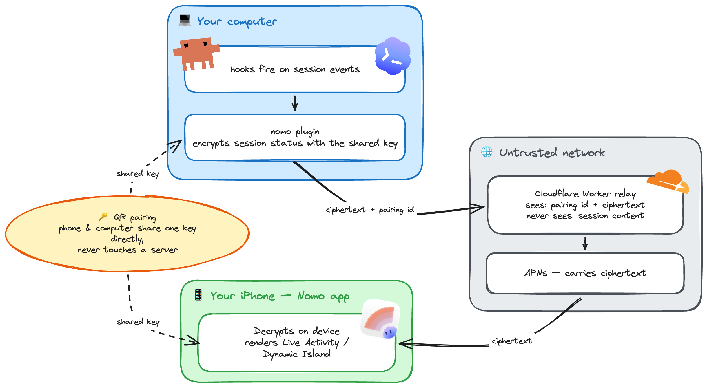

<p align="center"></p>

# Nomo — Live Activity on your iPhone

<p align="center">
&nbsp;&nbsp;
&nbsp;&nbsp;
&nbsp;&nbsp;

</p>

<p align="center">
<a href="https://apps.apple.com/app/nomo-ai-status-usage/id6779366830"></a>
</p>

Mirror your **Claude Code**, **OpenAI Codex** and **OpenCode** session milestones to the
**Nomo iPhone app** as a Live Activity (Dynamic Island). A session's status — working,
needs-your-approval, done — shows up on your phone in real time, so you can step away from the
terminal and still know when an agent needs you or has finished. When an agent stops for a
permission prompt or a question, you can **answer it from the phone** — tap Allow/Deny or pick an
option and the session carries on without you at the keyboard. Works with **Codex** in the terminal
and the **Codex desktop app** alike.

Everything is **end-to-end encrypted**. Pairing is a single QR-code scan (or a short typed code);
there is no server key to copy. All session content (titles, machine name, status, even *which* agent
produced an event) rides **inside** an encrypted blob, so the relay Worker that fans out the APNs
push is a blind relay and never sees plaintext. **One pairing covers every agent** on a machine —
Claude Code, Codex and OpenCode share the same credentials, encryption key, watchdog, and Live
Activity.

> [!NOTE]
> **This README is the contributor and security view** — how it's built, how it's wired, and what
> the crypto actually guarantees. The user guide (pairing walkthrough, command reference,
> per-agent differences, troubleshooting) lives at **[docs.nomo.gg](https://docs.nomo.gg)**.

> [!NOTE]
> **Platforms:** developed and tested on **macOS** and **Linux**. **Windows is untested** — it may
> work (the hooks are pure Node built-ins), but nothing on Windows has been verified, so treat it as
> unsupported for now.

The PC side ships as **three integrations over one shared `plugin/` directory**: a **Claude Code
plugin** (`nomo-cc`), a **native Codex plugin** (`nomo`), and an **OpenCode plugin module**. Claude
Code and Codex bundle the same self-contained `.mjs` hooks, the liveness watchdog, and the
interactive commands as single-file artifacts that run under **either bun or node ≥ 18** (a `run.sh`
shim picks whichever is installed); OpenCode instead loads one resident `.js` bundle inside its own
server process. There are **zero npm dependencies** — Node built-ins only.

## Architecture — end-to-end encrypted

Pairing establishes **one shared key** that only your phone and computer ever hold — no server
sees it. There are two ways to hand it over, and both keep the key off every server:

- **Scan the QR** on the pairing page. The QR carries a random pairing secret that rides only in the
  code image; the phone mixes it with its own nonce (HKDF-SHA256) to derive the shared key.
- **Type the one-time code** — six words and a short channel number (e.g.
  `7-ocean-sunset-mango-river-atlas-cabin`). The phone runs PBKDF2-SHA256 over the six words to
  reconstruct the same secret, then the same HKDF step, arriving at the identical key. The words never
  leave the pairing page; the channel is only a one-time routing handle the phone redeems once (it
  burns on first use and expires in 10 minutes).

Either way, the plugin encrypts every session update with the derived key **before** anything leaves
your machine, so the relay Worker and Apple's push service only ever carry ciphertext. Decryption
happens on your iPhone.

<picture>
  <source media="(prefers-color-scheme: dark)" srcset="assets/architecture-dark.png">
  
</picture>

<sub>Diagram source: [`assets/architecture.excalidraw`](assets/architecture.excalidraw) — open it at [excalidraw.com](https://excalidraw.com) to edit.</sub>

**Plaintext — titles, machine name, status, even which agent produced the event — never leaves
your computer except end-to-end encrypted.** The Worker is a blind fan-out relay: it can route by
pairing id but cannot read a single field of what it forwards.

### The code is never printed

By default the one-time pairing code is shown **only on the pairing page**, behind a "Tap to reveal
code" control — it is never printed to the terminal, so it cannot end up in shell history, a screen
recording, or an AI assistant's transcript. `pair.mjs --show-code` (`/nomo-cc:pair code`,
`$nomo-pair code`, `/nomo-pair code`) is the deliberate opt-out for a headless or SSH-only box: it
skips the page and prints the code to stdout, where it is sensitive for the ~10 minutes it is valid.
When a browser is available at all, prefer the page — scanning the QR never touches a keyboard, a
terminal, or a chat transcript. Walkthrough: [docs.nomo.gg/setup/pairing](https://docs.nomo.gg/setup/pairing).

## Encryption

In plain English:

- **Every session update is sealed with AES-256-GCM** before it leaves your machine. The relay Worker
  and Apple's push service only ever carry ciphertext — they can route it by pairing id but can't read
  a single field (title, machine name, status, or which agent produced it). The relay is **blind**:
  the only things that transit it in the clear are *public* keys.
- **The typeable code is six BIP39 words (~66 bits of entropy)**, stretched with **PBKDF2-SHA256 at
  600,000 iterations**. Six words (up from four) puts an offline brute-force — the attack a
  logging/compromised relay could try against the known-plaintext pairing blob — out of reach.
- **A per-pairing ephemeral ECDH (P-256) "ratchet" derives the durable key.** The code (or the
  scanned QR secret) only bootstraps a one-time handshake key; your computer and phone each generate a
  throwaway keypair, do an ECDH, and mix the result with that bootstrap key to produce the key that
  actually encrypts your sessions. The throwaway private keys are discarded right after pairing. This
  gives **forward secrecy**: a code revealed *after* you've paired — leaked into a screen recording, a
  shell history, or an AI transcript — **can't decrypt your sessions**, because the ephemeral private
  keys it would need are already gone. Mixing the code into the handshake also stops a relay from
  quietly swapping the public keys (a man-in-the-middle): if it tampers, pairing fails instead of
  silently succeeding under the attacker's key.

## Install — one command

```sh
bunx nomo-ai     # or: npx nomo-ai
```

It detects which of Claude Code, Codex and OpenCode are on this machine, shows exactly what it
will run for each, and lets you toggle the list before anything happens. Then it drives **each
host's own install path** — the same three flows spelled out below — and prints the restart-and-pair
step for each one it installed.

It is a **bootstrapper, not a package manager**: it never writes into `~/.claude` or `~/.codex`
itself, because those hosts own install *and* update through their marketplaces, and a second writer
racing `claude plugin update` is how you end up with two versions fighting over one watchdog daemon.
There is deliberately **no `postinstall` hook** — a package that edits your agent config just because
you `npm install`ed it is the shape you should distrust. It only does something when you run it.

It never pairs your phone. Pairing stays the deliberate step you run from inside the agent
afterwards.

For scripting and CI:

| Flag | |
|---|---|
| `--claude` `--codex` `--opencode` | install exactly these — naming any one of them skips the prompt |
| `--all` | all three, detected or not |
| `-y`, `--yes` | no prompt; install everything detected |
| `-n`, `--dry-run` | print the commands, run nothing |
| `-h`, `--help` / `-v`, `--version` | |

With no flags and no terminal to ask, it refuses rather than guessing. Every failure names the step,
the exit code, and the command to run by hand; the exit status is non-zero if any agent failed.

The OpenCode leg clones this repo to `~/.nomo` (or `git pull`s an existing one) and runs
`plugin/scripts/opencode-install.sh` from there — the same thing you would do by hand below. It has
to be a durable checkout, not the npm tarball: the installed stub re-exports an absolute path, and a
`bunx` cache directory does not survive the week.

##  Install — Claude Code

From inside Claude Code:

```
/plugin marketplace add KarrixLee/nomo
/plugin install nomo-cc@nomo
```

Restart Claude Code so the hooks load, then pair this machine with your phone:

```
/nomo-cc:pair
```

It opens a browser page with a QR code; scan it from the Nomo app's **Sessions** tab
(**Pair a Computer**). Once it reports `Paired with … ✓` this machine's sessions appear in the app.

Five commands, all namespaced `nomo-cc:` — `pair`, `status`, `approvals`, `reset`, `unpair`
([reference](https://docs.nomo.gg/sessions/commands)).

The lifecycle hooks (`SessionStart`, `UserPromptSubmit`, `PreToolUse`, `PostToolUse`,
`Notification`, `PermissionRequest`, `Stop`, `SessionEnd`) are wired automatically by the plugin —
no `settings.json` edits. The hook is deliberately silent: no pairing → no-op; network down → 2 s
timeout, exit 0. It cannot affect a Claude Code session.

##  Install — OpenAI Codex

Codex (**≥ 0.142**) ships a native plugin system, so Nomo installs as a standalone Codex plugin
(also named `nomo`, sharing the same `plugin/` directory as the Claude manifest). No Claude Code
required. From inside a Codex session — or the **Codex desktop app**'s built-in terminal:

```
codex plugin marketplace add KarrixLee/nomo
codex plugin add nomo@nomo
```

Then **trust the hooks once**: run `/hooks` and trust the **seven Nomo entries**. They ship with the
plugin (`plugin/hooks/codex-hooks.json`) but stay **inert until trusted** — this is Codex's own
safety gate, which Nomo cannot pre-approve. Skipping it leaves the plugin installed and silently
doing nothing. The hook command lines are byte-stable across releases, so trusting once holds
through updates (only a changed hook line re-arms the review).

Pair with `$nomo-pair`; the other four skills are `$nomo-status`, `$nomo-approvals`, `$nomo-reset`,
`$nomo-unpair` ([reference](https://docs.nomo.gg/sessions/commands)). There is **no separate Codex
pairing** — the hooks and skills read the same `~/.config/cc-status/config.json`, so they stay inert
(exit 0) until pairing completes. On the wire the only difference from Claude Code is that Codex's
encrypted blob is tagged `agent: "codex"`, so the phone can brand it.

Codex `request_user_input` questions additionally need the Codex task and the Nomo watchdog to share
one app-server process — see [docs.nomo.gg/sessions/codex](https://docs.nomo.gg/sessions/codex).

## Install — OpenCode

OpenCode has no marketplace and no hooks: it loads **one resident plugin module** inside its own
server process, auto-discovering `{plugin,plugins}/*.{ts,js}` in its config directories. So the
install is a clone plus **one command** — no `opencode plugin` command, and deliberately **no
npm-resolved plugin**: OpenCode's `Npm.add` short-circuits on an existing cache directory, so a bare
spec resolves `@latest` exactly once and never updates again. (`bunx nomo-ai` automates the clone
below; it hands OpenCode a filesystem path, never a package spec.)

Already installed Nomo for Claude Code or Codex? Reuse that copy — `claude plugin list` /
`codex plugin list` prints its path. Otherwise clone the repo anywhere:

```sh
git clone https://github.com/KarrixLee/nomo.git ~/.nomo
~/.nomo/plugin/scripts/opencode-install.sh
```

That is the whole install. The script resolves its own location, so there is no path to look up and
nothing to hand-edit. It writes two things and prints exactly what it wrote:

- `~/.config/opencode/plugins/nomo.js` — a one-line stub re-exporting `<checkout>/plugin/dist/opencode.js`.
- `~/.config/opencode/commands/nomo-*.md` — the five slash commands, with the plugin path baked in.

Re-running it is safe and idempotent; run it again if you move the checkout. It refuses to overwrite
a same-named file it did not write (pass `--force` to override), and `--project` installs into
`./.opencode/` for one repo instead of globally.

**Restart OpenCode** — plugins are imported once at server start; there is no hot reload.

The stub is a **re-export, not a copy**: the bundle keeps executing from `plugin/dist/`, where it can
find its sibling `cc-watchdog.mjs`, and a `git pull` in the checkout upgrades you with no reinstall.
OpenCode auto-discovers the directory, so there is nothing to add to `opencode.json`.

The five commands are the same ones the other two agents ship, minus the namespace — OpenCode command
names are flat and global, so they are `/nomo-pair`, `/nomo-status`, `/nomo-approvals`,
`/nomo-reset`, `/nomo-unpair` ([reference](https://docs.nomo.gg/sessions/commands)).

**Pairing is shared, and `/nomo-pair` also works standalone.** The plugin reads the same
`~/.config/cc-status/config.json` as the other two agents, so if you already paired with
`/nomo-cc:pair` or `$nomo-pair` there is nothing to do. If this machine has never been paired,
`/nomo-pair` does the whole pairing from inside OpenCode — then **quit and reopen OpenCode**, because
the plugin read the (absent) config once at server start and already decided to no-op for that
process. Unpaired, it stays silent. On the wire the only difference is the `agent: "opencode"` tag,
so the phone can brand it.

`opencode --pure` starts without external plugins, if you ever need to A/B whether Nomo is involved
in something.

### What OpenCode does and doesn't do

- **Approvals work**, on both channels: `permission.asked` (Allow / Always / Deny) and
  `question.asked` (pick an option, or decline). Todo lists ride along as ambient plan detail.
- **"Open on Mac" is not available** for OpenCode sessions — `opencodeAdapter` has no `locateTuiPid`,
  so nothing can point at the terminal that owns the session.
- **Auto vs. manual approval mode is not observable.** It is TUI-side state that never crosses HTTP,
  so the phone cannot show which mode a session is in.
- **Plan mode shows a "Planning" indicator only.** With `OPENCODE_EXPERIMENTAL_PLAN_MODE` off (the
  default) a plan turn emits no plan document, so there is nothing to send; the phone gets the
  indicator. With the flag on, `plan_exit` rides the question channel and arrives on the phone as a
  normal approval, with no plugin change.
- A session's liveness is the **OpenCode server process**, not the terminal — quit OpenCode to retire
  a row that looks stale.

## Answering from your phone

When a session stops for a **permission prompt** or a multiple-choice **question**, the card reaches
the phone with its options; the answer rides back inside the same E2E-encrypted blob, so the relay
never learns what you chose. Works for all three agents. `/nomo-cc:approvals` (or `$nomo-approvals`,
`/nomo-approvals`) is the local off switch when your phone is away — one switch, machine-wide.

Only sessions your phone is actually showing are answerable, and a hold is never open-ended — it is
**fail-open**: if no answer arrives (phone asleep, network down, ~5 min ceiling), the prompt simply
reappears in the terminal. Nomo can delay a decision; it can never make one for you. Details:
[docs.nomo.gg/sessions/approvals](https://docs.nomo.gg/sessions/approvals).

## How it works

- **Pairing.** `pair` opens a themed browser page with a QR code and a one-time code; it derives a
  per-pairing E2E key from the QR-scanned secret (or the typed code, via PBKDF2) + the phone's nonce
  (HKDF-SHA256), and writes `~/.config/cc-status/config.json` (mode `0600`) with the pairing id,
  the PC secret, and the 32-byte key. Nothing is copied by hand.
- **Hook.** On every Claude Code / Codex lifecycle event the hook plans a v2 op (`start` / `update` /
  `done` / `end` with a `working` / `needsAttention` / `done` status), encrypts the payload, and POSTs
  the blob to the relay Worker, which pushes it to the phone via APNs.
- **Resident module (OpenCode).** No hooks and no one-shot processes: a single module runs inside
  OpenCode's own server process and reduces its event firehose into the same frames. Because it is a
  guest in the user's editor, it must never throw, block, print, or install process-wide signal
  handlers — see the landmine notes in `src/opencode/plugin.ts` and `src/opencode/approvals.ts`.
- **Liveness watchdog.** Closing a terminal kills the agent without a clean end event, so a session
  could otherwise show "working" forever. Each event records `sessions/<id>.json` with the agent's
  pid; a single detached `cc-watchdog.mjs` polls every 5 s and POSTs a corrective `end` once that
  pid is dead (Codex interrupts are detected from the rollout transcript). When no sessions remain
  it exits; the next hook re-spawns it.
- **LAN fast path.** When the phone is on the same network, the watchdog hosts a tiny local HTTP
  listener so commands and answers travel direct (<200 ms) instead of waiting to be piggybacked on
  the next relay response (~5–12 s). It is strictly additive: the relay leg runs in parallel and
  stays canonical, so every LAN failure collapses into "the relay wins", never a lost command. The
  envelope carries a **second** seal (`K_lan`, HKDF-derived from the pairing key) so nobody on the
  Wi-Fi can read even the metadata, and a relay ciphertext simply won't open on the LAN channel.
  Off by default — turn it on in the Nomo app.
- **Encryption boundary.** The Worker only ever sees ciphertext; decryption happens on the phone
  (and, for the Live Activity, in the widget at render time). The agent marker is inside the blob,
  so even the fan-out relay can't tell one agent from another.

State lives under `~/.config/cc-status/`. Set `NOMO_WORKER_URL` to point at a staging Worker at
pair time; leave it unset for the default.

## Development

The portable TypeScript sources live in `src/`, grouped into `entries/` (the bundled
entrypoints), `core/` (shared leaf modules — paths/config, E2E crypto, the hook op planner, the
agent adapters), `opencode/` (the resident OpenCode module), and `qr/` (the vendored QR encoder). All
are written to run unmodified under **bun and node ≥ 18** — no `Bun.*` runtime APIs, no npm
dependencies.

### Tests

```
bun test
```

Runs the full suite (1677 tests across `core/`, `entries/`, `opencode/`, and `qr/`).

### Building the plugin bundle

```
bun build.ts
```

`build.ts` bundles the ten hook/command entrypoints (`cc-status`, `cc-permission`, `codex-status`,
`codex-permission`, `codex-notify`, `cc-watchdog`, `pair`, `unpair`, `reset`, `status-cmd`) into
`plugin/dist/*.mjs`, inlining every local import so each artifact is a single node-runnable file.

A second pass bundles `src/opencode/plugin.ts` into `plugin/dist/opencode.js` — **`.js`, not
`.mjs`**, because OpenCode discovers plugins with the glob `{plugin,plugins}/*.{ts,js}` and would
never see a `.mjs`. It is the one resident module (no hooks, no shim, no one-shot processes), which
is why it has no `hooks.json` entry and no `hook-shim.sh` whitelist row.

The OpenCode slash commands are **templates**, not built artifacts: `plugin/opencode-commands/*.md`
(filename = command name) each carry a `__NOMO_ROOT__` placeholder, and
`plugin/scripts/opencode-install.sh` substitutes the resolved plugin path as it copies them into the
user's `commands/` directory. Baking the path in is unavoidable — OpenCode gives a command file no
equivalent of Claude's `${CLAUDE_PLUGIN_ROOT}` and no `plugin list` to recover it from, the way the
Codex skills do. Add a command by dropping another `.md` in that directory; the installer picks it
up with no code change.

`plugin/dist/` **is committed to the repo.** Marketplace installs are a plain `git clone` of this
repository — there is no CI build step, and the `nomo-ai` npm package ships only the installer, not
the bundle — so the committed `dist/` is what actually runs. Re-run `bun build.ts` after any source change so `dist/` stays reproducible from source, and
commit the regenerated bundles. The committed bundle was built with `bun 1.3.10`; use the same
major/minor to reproduce it byte-for-byte.

### Releasing

The plugin version is written in **manifests that must move together** — a release that bumps all
but one installs a stale version somewhere. The current number is deliberately NOT repeated in this
sentence: `build.ts` cross-checks the JSON manifests against each other, never prose, so a version
written here goes stale silently with nothing to catch it (it had already drifted to 2.1.5 while the
manifests said 2.1.7). The manifests are the source of truth; read them.

- `.claude-plugin/marketplace.json` (Claude Code marketplace)
- `.agents/plugins/marketplace.json` (Codex marketplace)
- `plugin/.claude-plugin/plugin.json` (`nomo-cc`)
- `plugin/.codex-plugin/plugin.json` (`nomo`)
- `package.json` (the `nomo-ai` npm bootstrapper)

OpenCode has no manifest — it installs from the checkout, so `git pull` is its version.

`bun build.ts` cross-checks all five and refuses to build on disagreement. `package.json` carries the
version only so `bunx nomo-ai --version` is quotable in a bug report; it ships no plugin code. The
npm publish is a separate manual step — `npm pack --dry-run` first: the tarball is `bin/` plus the
three files npm always adds (`package.json`, `README.md`, `LICENSE`), and nothing else.

## License — MIT

Released under the [MIT License](LICENSE). © 2026 KarrixLee.
